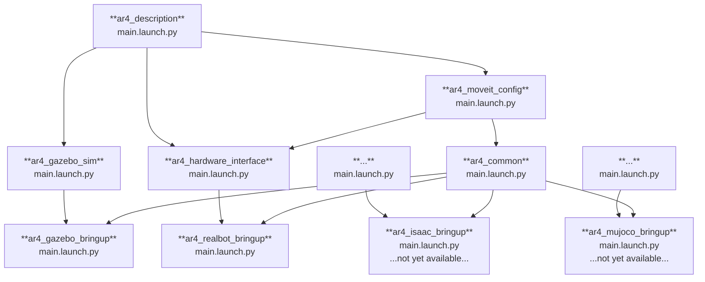
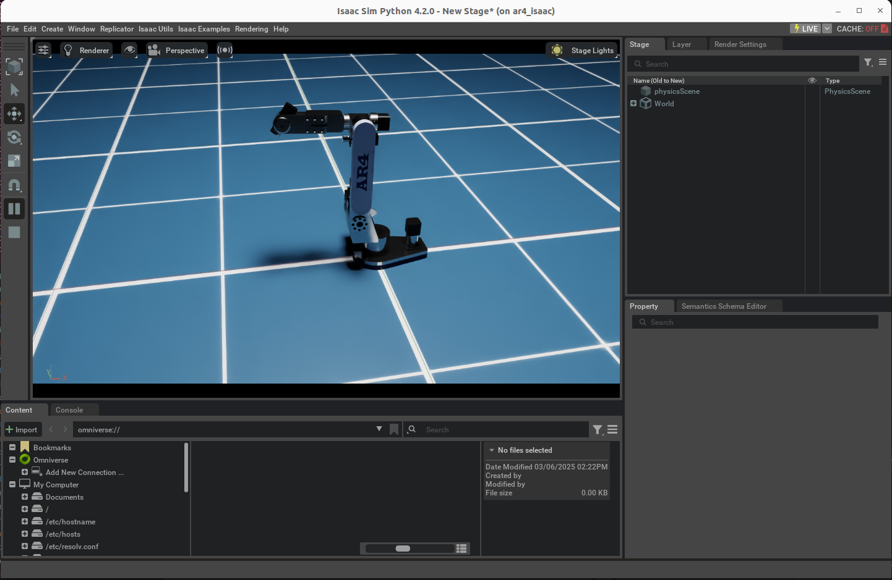

# AR4 ROS 2 Software

The [Annin Robotics AR4](https://www.anninrobotics.com/) robot is a 6DOF desktop size industrial robot that is a free, open plan low cost robot. This repository contains the necessary ROS 2 packages to plan and execute motions in Gazebo sim.

It provides a ROS 2 set of packages to be able to control the AR4 robot both in real hardware and
a number of different simulation environments.

<p align="center">
  
</p>

## Package Summary

These are the main packages providing launch files for the different use cases:

- [`ar4_description`](./ar4_description): Contains the platform-agnostic parts of the URDF robot description.
- [`ar4_gazebo_bringup`](./ar4_gazebo): Launch a Gazebo Sim simulation of AR4.
- [`ar4_isaac_bringup`](./ar4_gazebo): **Not yet available.** Launch an Isaac Sim simulation of AR4.
- [`ar4_mujoco_bringup`](./ar4_gazebo): **Not yet available.** Launch a Mujoco-based simulation of AR4.
- [`ar4_realbot_bringup`](./ar4_gazebo): Launch drivers and control software for the real AR4 robot.
- [`ar4_isaac`](./ar4_isaac): Isaac simulation for the ar4 arm.




## Installation

### Prerequisites

It is a requirement to have `docker engine` with the `docker compose plugin` already installed in the host machine.

See: [Docker Installation Guide](https://docs.docker.com/engine/install/ubuntu/)

### Running the dev container

Build and run the container for the use case you are interested in

#### Gazebo

Launch the docker container with the following command:

```bash
./docker/run.sh -s ar4_gazebo
```

Then build and launch Gazebo bringup launch file:

```bash
colcon build --symlink-install --packages-up-to ar4_gazebo_bringup \
 && source install/setup.bash \
 && ros2 launch ar4_gazebo_bringup main.launch.py
```


#### Hardware

* [Hardware Interface Instructions](ar4_hardware_interface/README.md)


### Controlling the AR4 with MoveIt

To plan and command the arm to execute a motion, this launch file will also start MoveIt automatically. Once launched, you should see RViz showing the robot visualization and the MotionPlanning panel on the left.

There are two ways of selecting a target position for the arm using `RViz`:
1. Selecting a random valid position.
2. Moving the end effector to a desired position.


####  1. Selecting random valid position
This will select a random position for the arm that would not cause a collision with itself or objects around it, calculated from the semantic information of the robot.

[Random valid position video](https://github.com/user-attachments/assets/ec926968-8952-4ccf-ba63-5423e94f61cd)


####  2. Moving end effector to a desired position
This allows you to select a goal position for the end effector, which is currently the last link in the arm as no gripper is being used. This is done by dragging and dropping where the end effector should move to.

[User selected position video](https://github.com/user-attachments/assets/04dbb11c-bca4-4c05-95ae-251d70f41931)


## Isaac sim



See: [Isaac Sim Instructions](ar4_isaac/README.md)

## Licenses

All packages in this repository except for `ar4_description` and `ar4_hardware_interface` are distributed under a **BSD 3-Clause** License.

`ar4_description` is a derivative work from the [ar4_ros_driver](https://github.com/ycheng517/ar4_ros_driver/tree/main/annin_ar4_description) repository, which is distributed under a **MIT License**.
