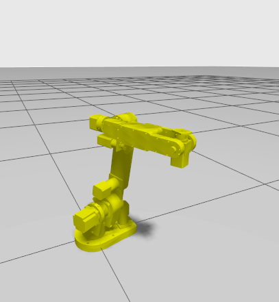

# AR4

The Annin Robotics AR4 robot is a 6DOF desktop size industrial robot that is a free, open plan low cost robot. This repository contains the necessary ROS 2 packages to plan and execute motions in Gazebo sim. It provides the arm description, simulation controllers and Moveit configuration needed to command it.

<p align="center">
  
</p>

## Package Summary

- [`ar4_control`](./ar4_control): Contains the configuration for the simulation ros2_control controller.
- [`ar4_gazebo`](./ar4_gazebo): Gazebo simulation for the ar4 arm.
- [`ar4_description`](./ar4_description): Contains the URDF of the arm.
- [`ar4_moveit_config`](./ar4_moveit_config): Contains configuration and launch files to run and command the arm.

## Installation

### Docker

#### Prerequisites

It is a requirement to have `docker engine` with the `docker compose plugin` already installed in the host machine.

* See [Docker Installation Guide](https://docs.docker.com/engine/install/ubuntu/)

#### Building and running the ar4 dev container

**Important note:** If real robot is going to be used, it is required to:
- Connect the device to the computer before running the container.
- Uncoment the comented lines in [docker-compose.yml](./docker/docker-compose.yml) to give the container access to the teensy.

Build and/or run the container
```bash
./docker/run.sh
```

Force rebuilding the image

```bash
./docker/run.sh --build
```

## Build the packages and run the simulation

Build the packages

```
colcon build
```

Source the built packages

```
source install/setup.bash
```

---

### Launch the simulation

After building and sourcing the packages, run the Gazebo simulation:

```
ros2 launch ar4_gazebo gazebo_moveit.launch.py
```


By default, this will launch the simulation with the ROS bridge enabled.


If you want to disable the ROS bridge, use:

```
ros2 launch ar4_gazebo gazebo_moveit.launch.py use_ros_bridge:=false
```

### Controlling the arm with MoveIt

To plan and command the arm to execute a motion, this launch file will also start MoveIt automatically. Once launched, you should see RViz showing the robot visualization and the MotionPlanning panel on the left.

There are two ways of selecting a target position for the arm, both through RViz:
- Selecting a random valid position.
- Moving the end effector to a desired position.

---

### Selecting random valid position
This will select a random position for the arm that would not cause a collision with itself or objects around it, calculated from the semantic information of the robot.

https://github.com/user-attachments/assets/be9406d2-6589-456c-8ae6-edbbe067b701


### Moving end effector to a desired position
This allows you to select a goal position for the end effector, which is currently the last link in the arm as no gripper is being used. This is done by dragging and dropping where the end effector should move to.

https://github.com/user-attachments/assets/a3057320-02ba-4898-8c07-b08d86ec0dcf


## Licenses

All packages in this repository except for `ar4_description` are distributed under a **BSD 3-Clause** License.

`ar4_description` is a derivative work from the [ar4_ros_driver](https://github.com/ycheng517/ar4_ros_driver/tree/main/annin_ar4_description) repository, which is distributed under a **MIT License**.
