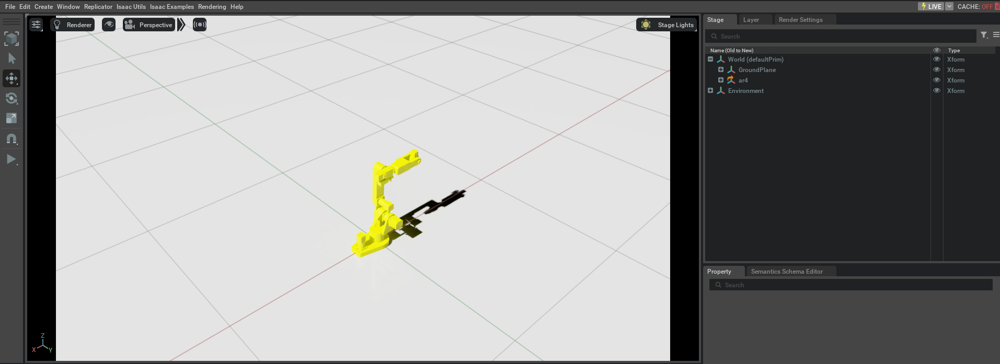

# Description
An Isaac simulation of the AR4 Package.

## Prerequirements

Running the `nvidia` isaac simulation requires:

  - Minimum specs (See: [Isaac Sim System Requirements](https://docs.omniverse.nvidia.com/isaacsim/latest/installation/requirements.html#system-requirements)
  - [Installing the NVIDIA Container Toolkit](https://docs.nvidia.com/datacenter/cloud-native/container-toolkit/latest/install-guide.html)

## Run the simulation container

```
docker/run.sh -s ar4_isaac
```

## Launch the simulation
```
# From the container
./src/ar4/ar4_isaac/launch.sh
```


## Update the robot usda model

If changes were made in the [ar4.urdf.xacro](../ar4_description/urdf/ar4.urdf.xacro), a new robot model for Isaac needs to be created.

To create a new model:

- Convert the xacro `ar4.urdf.xacro` to `urdf`:

In the `ar4_description/urdf` directory, run:
```
xacro ar4.urdf.xacro > ar4.urdf
```

- In the `urdf` file, manually update the references to the meshes (this allow the meshes to be imported correctly on Isaac), e.g:

```
        <mesh filename="../meshes/base_link.STL"/>
```

- Import the URDF to Isaac following [these instructions](https://docs.omniverse.nvidia.com/isaacsim/latest/advanced_tutorials/tutorial_advanced_import_urdf.html)

## Manually load the robot

Open the `ar4.usda` file with Isaac
