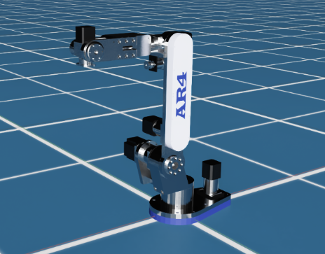

# Description
An Isaac simulation of the AR4 Package.

## Prerequirements

Running the `nvidia` isaac simulation requires:

  - Minimum specs (See: [Isaac Sim System Requirements](https://docs.omniverse.nvidia.com/isaacsim/latest/installation/requirements.html#system-requirements)
  - [Installing the NVIDIA Container Toolkit](https://docs.nvidia.com/datacenter/cloud-native/container-toolkit/latest/install-guide.html)

## Run the simulation container

```
docker/run.sh -s ar4_isaac
```

## Build the packages

Build the packages

```
source /opt/ros/humble/setup.bash
colcon build
```

Source the built packages

```
source install/setup.bash
```

## Launch the simulation
```
ros2 launch ar4_isaac ar4_in_empty_world.launch.py
```


## More:

  - [Update the model](docs/UPDATE_MODEL.md)
