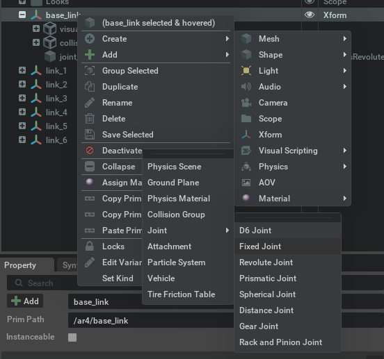

## Update the ar4_isaac USD

For changes made to the robot's urdf or meshes to impact the Isaac Sim model it's required to update the USD description.

1. Open the docker container

    ```bash
    docker/run.sh
    ```

2. Create a `urdf`

    ```bash
    xacro ar4_description/urdf/ar4.urdf.xacro > ar4_description/urdf/ar4.xacro
    ```

3. Update the `meshes` path
    ```bash
    - file:///workspace/install/ar4_description/share/ar4_description/meshes/base_link.stl

    + file:///workspace/src/ar4/ar4_description/meshes/base_link.stl
    ```

4. Open isaac sim

    ```bash
    docker/run.sh -s ar4_isaac
    ```

    ```bash
    /isaac_sim/runapp.sh
    ```

5. Open the URDF importer

    Isaac Utils > Workflows > URDF Importer
    

6. Check the following options:

    - Fix Base Link
    - Import Inertia Tensor
    - Clear Stage
    - Self Collision
    - Collision From Visuals

7. Select the generated `urdf` in step 2 (with step 3 mods) as the input file

8. Select an output directory and press Import

9. Set the lightning to default and you should see the robot


10. Tune the gray material

    First, open the newly created `ar4.usd` in the selected output path

    Then, in the stage description go to `ar4 > Looks > material grey`. And in the `Material and Shader` options go to `Reflectivity` and set:

    - Roughness Map Influence to 0.5
    - Metallic Amount to 1.0

    

11. Correctly set the root Articulation

    You'll notice a `root_joint` was created, delete it (Right Click > Delete).
    

    Now go to the `ar4` and add an `Articulation Root`:

    Right Click > Add > Physics > Articulation Root

    

12. Fix the base link

    Add a FixedJoint to the base_link:

    Right Click > Create > Physics > Joints > FixedJoint
    

13. Update the `Maximum Joint Velocity` and the `Max Force` for each joint

    These options are in the `Property` of each joint, under the `Raw USD Properties` and `Extra Properties`.

    The values used are `5000` for `Maximum Joint Velocity` and `3000` for `Max Force`.

    

14. Use the [Gain Tuner](https://docs.omniverse.nvidia.com/isaacsim/latest/features/robots_simulation/ext_omni_isaac_gain_tuner.html) to tune the `Damping` and `Stiffness`

    

15. Override the existing `ar4_layer.usda`

    Finally save your output as `usda` overriding the existing ar4_layer. (Note: Select the type to `*.usda`)

    File > Save As... > ar4_isaac/usda/layers/ar4_layer.usda
